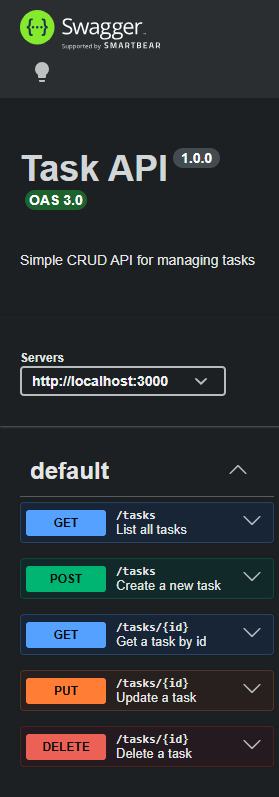

# Week 1 Task API

This project is a simple Express-based CRUD API for managing tasks. It stores tasks in memory, exposes JSON endpoints, and includes Swagger UI documentation for interactive testing.

## Install and run

Run the app with a single command:

```bash
npm start
```

The API will be available at http://localhost:3000.

## Endpoints

| Method | Path | Description |
| --- | --- | --- |
| GET | /health | Health check endpoint |
| GET | /tasks | List all tasks |
| POST | /tasks | Create a new task |
| GET | /tasks/:id | Get one task by id |
| PUT | /tasks/:id | Update a task |
| DELETE | /tasks/:id | Delete a task |

## Example curl output

```bash
curl -i http://localhost:3000/tasks
```

```text
HTTP/1.1 200 OK
Content-Type: application/json; charset=utf-8

[{"id":1,"title":"Buy milk","done":false},{"id":2,"title":"Write report","done":true},{"id":3,"title":"Call mom","done":false}]
```

## Swagger UI

Open http://localhost:3000/docs to explore the API in Swagger UI.



